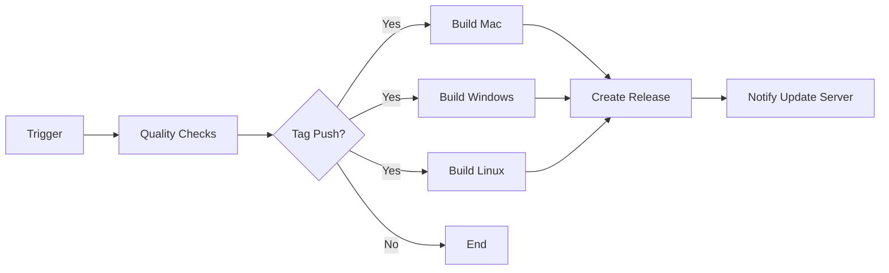

# Release Process Documentation

This document outlines the complete release process for MoodbooMs, from development to distribution.

## Table of Contents
1. [Prerequisites](#prerequisites)
2. [Release Types](#release-types)
3. [Automated Release Process](#automated-release-process)
4. [Manual Release Process](#manual-release-process)
5. [CI/CD Pipeline](#cicd-pipeline)
6. [Troubleshooting](#troubleshooting)

## Prerequisites

Before releasing, ensure you have:

- [ ] All changes merged to main or epic branch
- [ ] All tests passing
- [ ] Code review completed
- [ ] Documentation updated
- [ ] GitHub secrets configured (for automated releases)

### Required GitHub Secrets

For automated builds and releases, configure these secrets in your repository:

#### macOS Signing
- `MACOS_CERTIFICATE`: Base64 encoded .p12 certificate
- `MACOS_CERTIFICATE_PWD`: Certificate password
- `APPLE_ID`: Your Apple ID email
- `APPLE_ID_PASSWORD`: App-specific password
- `APPLE_TEAM_ID`: Your Apple Team ID
- `APPLE_DEVELOPER_NAME`: Name on certificate

#### Windows Signing
- `WINDOWS_CERTIFICATE`: Base64 encoded .pfx certificate
- `WINDOWS_CERTIFICATE_PWD`: Certificate password

#### Error Tracking (Optional)
- `SENTRY_DSN`: Sentry project DSN

## Release Types

### Semantic Versioning
We follow [Semantic Versioning](https://semver.org/):
- **Major** (X.0.0): Breaking changes
- **Minor** (0.X.0): New features, backward compatible
- **Patch** (0.0.X): Bug fixes, backward compatible
- **Prerelease** (0.0.0-beta.X): Test releases

### When to Use Each Type

| Type | When to Use | Example |
|------|------------|---------|
| Patch | Bug fixes, small improvements | 1.0.0 → 1.0.1 |
| Minor | New features, no breaking changes | 1.0.0 → 1.1.0 |
| Major | Breaking changes, major redesign | 1.0.0 → 2.0.0 |
| Prerelease | Testing, beta features | 1.0.0 → 1.0.1-beta.1 |

## Automated Release Process

### Quick Release (Recommended)

1. **Use the release script**:
   ```bash
   ./scripts/release.sh [patch|minor|major|prerelease]
   ```

2. **Edit release notes** when prompted

3. **Script automatically**:
   - Runs tests
   - Builds application
   - Bumps version
   - Creates git tag
   - Pushes to GitHub
   - Triggers CI/CD pipeline

### What Happens Next

1. **GitHub Actions triggered** by tag push
2. **Quality checks** run (tests, linting, security)
3. **Builds created** for all platforms
4. **Code signing** applied (if certificates configured)
5. **Release created** with artifacts
6. **Update server notified** (if configured)

## Manual Release Process

If you prefer manual control:

### 1. Prepare Release

```bash
# Ensure you're on the right branch
git checkout main
git pull origin main

# Run tests
npm test -- --watchAll=false

# Build to verify
npm run build
```

### 2. Bump Version

```bash
# Choose version type
npm version patch  # or minor, major, prerelease
```

### 3. Create Release Notes

Create a file with release notes following the template in `.github/RELEASE_TEMPLATE.md`

### 4. Create and Push Tag

```bash
# Create annotated tag
git tag -a v1.0.0 -m "Release v1.0.0

[Your release notes here]"

# Push changes and tag
git push origin main
git push origin v1.0.0
```

### 5. Monitor CI/CD

- Go to GitHub Actions tab
- Watch the "Build and Release" workflow
- Verify all checks pass

### 6. Verify Release

- Check https://github.com/vadimgumarov/MoodbooMs/releases
- Download and test each platform build
- Verify auto-updater detects new version

## CI/CD Pipeline

### Workflow Triggers

The pipeline runs on:
- **Tag push** (`v*`): Full release
- **Pull requests**: Quality checks only
- **Manual trigger**: With release type selection

### Pipeline Stages



### Quality Checks
- Linting (when configured)
- Unit tests with coverage
- Build verification
- Security audit

### Platform Builds
- **macOS**: DMG installer, code signed and notarized
- **Windows**: EXE installer, code signed
- **Linux**: AppImage, Snap, DEB packages

## Troubleshooting

### Common Issues

#### Build Fails on CI

**Problem**: Build works locally but fails on GitHub Actions

**Solutions**:
- Check Node version matches CI (v18)
- Verify all dependencies in package.json
- Check for platform-specific code
- Review CI logs for specific errors

#### Code Signing Fails

**Problem**: "Certificate not found" or signing errors

**Solutions**:
- Verify secrets are set correctly
- Check certificate hasn't expired
- Ensure certificate matches platform
- Test with `if: env.CERTIFICATE != ''` conditionals

#### Release Not Created

**Problem**: Builds succeed but no release appears

**Solutions**:
- Check tag format (must start with 'v')
- Verify GITHUB_TOKEN permissions
- Check create-release job logs
- Ensure all platform builds succeeded

#### Auto-updater Not Working

**Problem**: App doesn't detect new releases

**Solutions**:
- Verify release is not marked as draft
- Check publish configuration in package.json
- Test with manual update check
- Review electron-updater logs

### Manual Workflow Trigger

For testing or manual releases:

1. Go to Actions tab
2. Select "Build and Release" workflow
3. Click "Run workflow"
4. Select:
   - Branch to build from
   - Release type (draft/prerelease/release)
5. Click "Run workflow"

### Rollback Procedure

If a release has critical issues:

1. **Mark as prerelease** on GitHub to prevent auto-updates
2. **Create hotfix branch**:
   ```bash
   git checkout -b hotfix/v1.0.1 v1.0.0
   ```
3. **Fix issue and test thoroughly**
4. **Release patch version** with fix
5. **Delete problematic release** after users update

## Best Practices

### Before Release
- [ ] Review all changes in the release
- [ ] Update documentation
- [ ] Test on all target platforms
- [ ] Check for security vulnerabilities
- [ ] Verify licenses of dependencies

### During Release
- [ ] Use descriptive release notes
- [ ] Include breaking changes prominently
- [ ] Credit contributors
- [ ] Link to relevant issues/PRs

### After Release
- [ ] Monitor error tracking for issues
- [ ] Check user feedback channels
- [ ] Update website/documentation
- [ ] Announce on social media
- [ ] Plan next release

## Release Checklist Template

```markdown
## Release Checklist for v[VERSION]

### Pre-release
- [ ] All PRs merged
- [ ] Tests passing
- [ ] Documentation updated
- [ ] CHANGELOG updated
- [ ] Version bumped

### Release
- [ ] Run release script
- [ ] Edit release notes
- [ ] Verify CI/CD pipeline
- [ ] Check release artifacts

### Post-release
- [ ] Test auto-updater
- [ ] Update website
- [ ] Send announcement
- [ ] Monitor error tracking
- [ ] Archive release branch
```

## Support

For issues with the release process:
1. Check CI/CD logs
2. Review this documentation
3. Open an issue on GitHub
4. Contact the maintainers

---

*Last updated: August 2025*